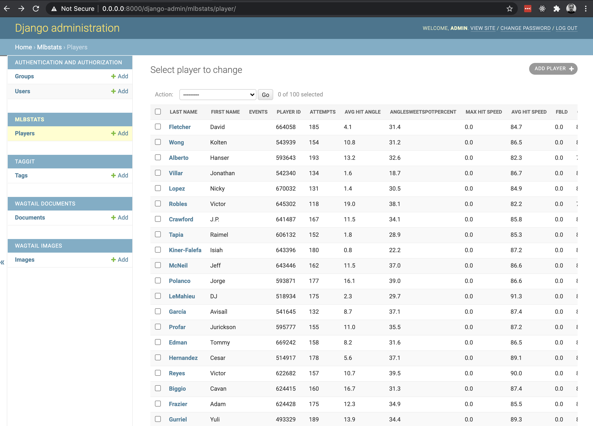

mlbstats - An exercise in `Sabermetrics <https://en.wikipedia.org/wiki/Sabermetrics>`_
======================================================================================

Two demos:

- Draw scatter plot (AKA "spraychart") from Player model data

  - Loaded from *exit_velocity.csv* via ``python manage.py load_ev``

- Draw scatter plot (AKA "spraychart") with player data from https://baseballsavant.mlb.com/

  - Based on example from https://www.baseballdatapros.com/posts/4

Had to `fork pybaseball <https://github.com/aclark4life/pybaseball>`_ to get ``scatterplot`` function to return matplotlab canvas.

Install
-------

::

    make virtualenv
    source bin/activate
    make install
    make npm-install
    make migrate
    make load_ev
    make serve

Based on
--------

- https://www.baseballdatapros.com/posts/4
- https://github.com/aclark4life/pybaseball
- https://github.com/aclark4life/aclarknet-best-pro/blob/master/aclark/db/plot.py
- https://baseballsavant.mlb.com/
- https://public.tableau.com/profile/datavizard#!/vizhome/HomeRunTracker/HomeRunsTracker
- https://github.com/AccordBox/python-webpack-boilerplate
- https://github.com/aclark4life/project-makefile

Screenshots
-----------

|

